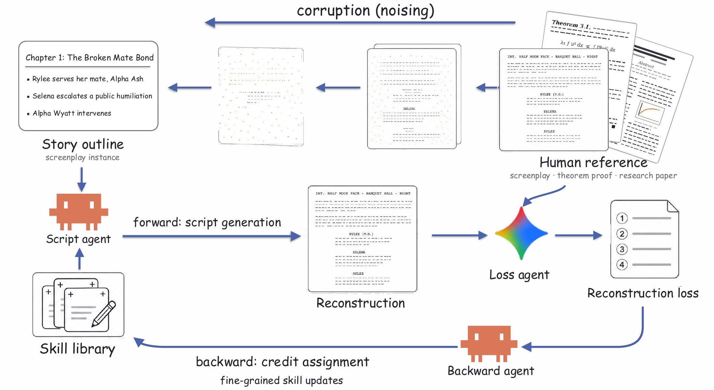
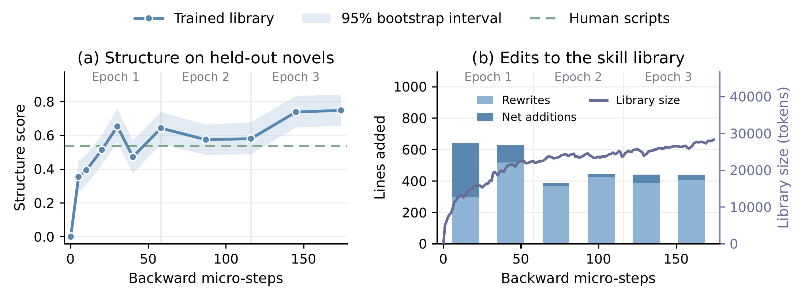
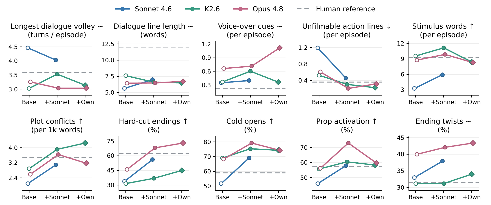

<p align="center">
  
</p>

<h1 align="center">Skill Training</h1>

<p align="center">Learn the craft. Keep the model frozen.</p>

<p align="center">
  <a href="https://skilltraining-project.github.io/">Project page</a> ·
  <a href="https://skilltraining-project.github.io/assets/paper.pdf?v=473e0fa1818b">PDF</a> ·
  <a href="https://arxiv.org/abs/2607.27557">arXiv</a> ·
  <a href="#quick-start">Quick start</a> ·
  <a href="docs/guide.md">Guide</a>
</p>

<p align="center">
  <a href="https://github.com/skilltraining-project/skill-training/actions/workflows/test.yml"></a>
  <a href="pyproject.toml"></a>
  <a href="LICENSE"></a>
  <a href="https://github.com/skilltraining-project/skill-training/stargazers"></a>
</p>

<p align="center">English · <a href="README.zh-CN.md">简体中文</a></p>

## Overview

Professional work contains skills that are difficult to explain as instructions. **Skill Training learns those skills from existing human artifacts**, without updating model weights or collecting new human annotations or external rewards.

The idea is simple: compress a professional screenplay into a story outline, ask an agent to reconstruct it, and learn from the gap between its draft and the original. What improves is an external **skill library**: small Markdown files the agent reads before writing. Each update is recorded in Git, so the learned rules can be inspected, edited, and reused.

This repository is the reference implementation of **Skill Training with Corruption and Reconstruction Loop**.

**Mo Li · Zixin Yin · Qihao Wu · Ting Cao · Yunxin Liu · Heung-Yeung Shum**<br>
Tsinghua University · Shanghai AI Laboratory · The Hong Kong University of Science and Technology · Xiaobing.AI

<p align="center">
  <a href="https://skilltraining-project.github.io/#method"></a>
</p>

| Stage | What happens | Entry point |
| :--- | :--- | :--- |
| **Corrupt** | Remove craft-level detail while preserving the story outline. | [`python -m skilltrain diffuse`](skilltrain/workflows/s1_diffuse.py) |
| **Reconstruct** | Generate a screenplay using relevant skill cards. | [`python -m skilltrain forward`](skilltrain/workflows/s2_forward.py) |
| **Compare** | Contrast the draft with the human original and describe the gaps. | [`python -m skilltrain loss`](skilltrain/workflows/s3_loss.py) |
| **Update** | Revise the skill library using the feedback. | [`python -m skilltrain backward`](skilltrain/workflows/s4_backward.py) |

[`python -m skilltrain prepare`](skilltrain/workflows/s0_prepare_data.py) prepares the source material. [`python -m skilltrain train`](skilltrain/workflows/s5_train.py) runs the training loop, saves its artifacts, and resumes interrupted runs.

## Results from the paper

The main experiment trains on **20 professional short-drama novels** and evaluates Claude Sonnet 4.6 on **385 episodes from six unseen novels**. All six metrics with a preferred direction improve significantly over the empty-library baseline in the paper’s paired bootstrap analysis.

| Writing behavior | Empty library | Trained library | Human reference |
| :--- | ---: | ---: | ---: |
| Unfilmable action lines per episode ↓ | 1.2 | **0.2** | 0.4 |
| Stimulus words per episode ↑ | 3.3 | **6.3** | 9.2 |
| Plot conflicts per 1,000 words ↑ | 2.10 | **3.69** | 3.47 |
| Hard-cut endings ↑ | 34% | **67%** | 62% |
| Cold opens ↑ | 52% | **74%** | 59% |
| Prop activation ↑ | 46% | **58%** | 57% |

These are specific writing behaviors, not a single measure of overall quality. In a separate blind preference study, readers favored trained-library scripts in **49 of 75 judgments**, with 17 baseline wins and 9 ties. The study used 15 episode pairs and five readers: three external practitioners and two paper authors.

### Learning over time

Across 174 skill-update steps, the structure score rises quickly in the first epoch and levels off near 0.75 in the third. The library’s updates gradually shift from adding rules to revising existing ones.

<p align="center">
  <a href="https://skilltraining-project.github.io/#training"></a>
</p>

Each snapshot is evaluated on the same **180 held-out episodes**, the first 30 from each unseen novel. The structure score averages four standardized structure metrics with the empty library set to zero. Shading is the 95% bootstrap interval; the dashed line is the human reference.

<details>
<summary><strong>Cross-model transfer: skills learned by one model can guide another</strong></summary>

A Sonnet-trained library also improves Kimi K2.6 and Claude Opus 4.8. With Sonnet’s library, Opus scores significantly higher on five of six directional metrics than with its own library. Hard-cut endings are the exception. These libraries are trained on **five novels**.

<p align="center">
  
</p>

</details>

The figures and numbers above are reported in the [paper](https://skilltraining-project.github.io/assets/paper.pdf?v=473e0fa1818b). This repository provides a compact reference implementation and an openly licensed example. The proprietary short-drama corpus is not distributed here; the example below does not reproduce the paper’s benchmark by itself.

## Quick start

### 1. Prepare the environment

Use Python 3.10+, Git, and an authenticated [Claude Code](https://claude.com/claude-code) command-line installation. The framework uses **only Python’s standard library**. Run all commands from the repository root; no package installation is needed. The commands below use [uv](https://docs.astral.sh/uv/) to create a local environment.

```bash
git clone https://github.com/skilltraining-project/skill-training
cd skill-training
uv venv --python 3.12
source .venv/bin/activate

python -m unittest discover tests
```

The offline checks do not call a model. PDF extraction requires `pdftotext` (`brew install poppler` on macOS or `sudo apt install poppler-utils` on Ubuntu). The example workflow also uses Bash, curl, and the system `diff` command. macOS and Linux are supported.

### 2. Prepare an example and inspect one outline

```bash
bash data/get_example.sh
python -m skilltrain prepare --pdf data/example/source.pdf --episodes 20
python -m skilltrain diffuse --work data/example --only 1 --force
```

The example screenplay is **Valkaama**, licensed under CC BY-SA 3.0. See [data sources and attribution](data/README.md). Inspect the extracted episodes and the printed outline before continuing. If needed, adjust [`prompts/diffuse_heavy.md`](prompts/diffuse_heavy.md), then regenerate the full input:

```bash
python -m skilltrain diffuse --work data/example --noise heavy --force
```

`--only 1 --force` refreshes the chapter cache and prints the result without replacing the assembled `story.md`. The full command uses `--force` so prompt changes also reach previously cached chapters.

### 3. Train and inspect the learned skills

```bash
python -m skilltrain train --work data/example \
  --run-id demo --steps 4 --episodes-per-step 5

git -C runs/demo/memory log --oneline
git -C runs/demo/memory show HEAD
```

Re-run the training command with the same arguments to resume. Use a new `--run-id` for a new experiment. Training calls Claude Code and uses its configured authentication and usage allowance. The agents run with `--dangerously-skip-permissions`; their intended working directories are not a security sandbox.

For multi-work training, individual stages, frozen-library controls, and configuration, see the **[usage guide](docs/guide.md)**.

## Inside the repository

```text
skill-training/
├── skilltrain/              Training package and shared utilities
│   ├── __main__.py         Unified command-line entry point
│   ├── workflows/          Ordered workflow implementations
│   └── …                   Agent runner, data, memory, and trace utilities
├── prompts/                Seven editable task and training templates
├── tests/                  Offline checks
├── data/                   Example downloader and data instructions
├── docs/                   Usage guides and paper figures
└── pyproject.toml          Project metadata
```

Each run writes to `runs/<run-id>/`: generated scripts, loss reports, agent read traces, and a skill library with its own Git history. Each backward micro-step records the library before and after the update, its diff, and the completed commit.

**The learned artifact is readable text.** Skills are organized into general rules, craft techniques, and genre-specific rules. A format checker limits each card’s length and validates it before the update is committed. See [skill-card format and run artifacts](docs/guide.md#the-skill-library).

## Star history

<p align="center">
  <a href="https://www.star-history.com/#skilltraining-project/skill-training&Date"></a>
</p>

## Citation

```bibtex
@misc{li2026skilltraining,
  title         = {Skill Training with Corruption and Reconstruction Loop},
  author        = {Li, Mo and Yin, Zixin and Wu, Qihao and Cao, Ting
                   and Liu, Yunxin and Shum, Heung-Yeung},
  year          = {2026},
  eprint        = {2607.27557},
  archivePrefix = {arXiv},
  primaryClass  = {cs.CL},
  url           = {https://arxiv.org/abs/2607.27557}
}
```

## Contact and license

For questions and bug reports, [open an issue](https://github.com/skilltraining-project/skill-training/issues). For research inquiries, contact **Mo Li** at [limo.research@gmail.com](mailto:limo.research@gmail.com).

Code is released under the **[MIT License](LICENSE)**. The downloaded example screenplay has its own [CC BY-SA 3.0 license and attribution](data/README.md).

## Related Work

[Learning to Commit](https://github.com/LearningToCommit/LearningToCommit) learns repository-specific coding skills from commit history, without updating model weights.
